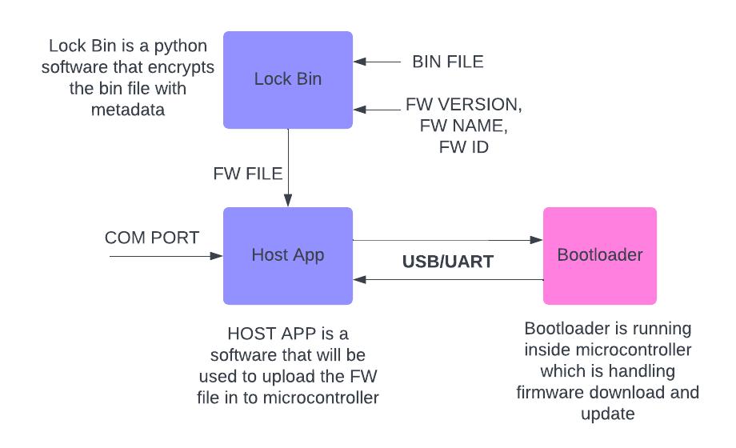

# STM32 Bootloader with USB/UART Firmware Update

🚧 Under Development
Please note: This firmware is currently in the development stage. Features may change, and the code may contain bugs. Use with caution and report any issues you encounter.




This bootloader for the STM32 microcontroller provides a robust and feature-rich solution for firmware updates. The bootloader is designed to facilitate firmware updates via the internal USB or UART interfaces, utilizing an external SPI Flash to store firmware temporarily.

# Key Features

- Dual Slot Firmware Storage: The bootloader manages two separate slots in external SPI Flash to store different versions of firmware. This allows for safe firmware updates with rollback capability.
  
- Firmware Rollback: In case of an update failure, the bootloader can revert to the previous working firmware, ensuring the device remains operational.
  
- CRC16 Validation: Each firmware stored in the SPI Flash is validated using CRC16 checks to ensure data integrity and prevent corrupted firmware from being executed.

- Encrypted Storage: The bootloader keeps all firmware data stored in SPI Flash in an encrypted form, enhancing security against unauthorized access.

- Version Management: The bootloader can report the current firmware version, helping in maintaining and tracking the firmware versions deployed on the device.

- External Python Script: A Python script is provided to assist with loading new firmware onto the device. This script also facilitates version reporting and other bootloader-related operations.


# Prerequisites

- Hardware: STM32 microcontroller with USB and UART interfaces.
- External Storage: SPI Flash module connected to the microcontroller.
- Software: Python installed on your host machine for running the external script.

# Building the Bootloader

1. Clone this repository:
   ```bash
   git clone https://github.com/mayankpatel97/STM32-SPIFLASH-UART-BOOTLOADER.git
   cd STM32-SPIFLASH-UART-BOOTLOADER
   ```
2. Configure the bootloader using your preferred IDE (e.g., STM32CubeIDE) or via command line.

3. Build the bootloader project and flash it onto your STM32 microcontroller.

# Using the Bootloader

1. Connect your STM32 device to your computer via USB or UART.

2. Run the provided Python script to load new firmware:
   ```bash
   python firmware_loader.py --port /dev/ttyUSB0 --file firmware.bin
   ```

3. The script will automatically handle the transfer, validation, and version management.

4. After the firmware is successfully loaded, the bootloader will perform a CRC16 check and either boot into the new firmware or revert to the previous version if an error is detected.

# Rollback Procedure

In case of an issue with the newly loaded firmware, the bootloader automatically reverts to the previous firmware stored in the other slot, ensuring the device remains operational.

# Checking Firmware Version

To check the currently running firmware version, use the following command:
```bash
python firmware_loader.py --port /dev/ttyUSB0 --version
```

# License

This project is licensed under the MIT License - see the [LICENSE](LICENSE) file for details.

# Contributing

Feel free to contribute to this project by submitting pull requests or opening issues for any bugs or feature requests.

# Acknowledgments

Special thanks to the open-source community for providing tools and libraries that helped in the development of this bootloader.
